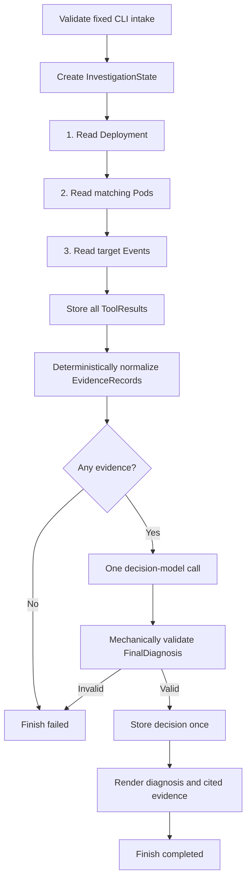

# v0 First-Workflow Architecture

The first workflow is one deterministic, read-only investigation of the reference broken-readiness scenario. It is an in-process CLI workflow, not an agent loop.

There is no model-directed collection, adaptive planning, retry loop, return from decision to collection, or remediation path.

## Component responsibilities

### Intake

- Parses the CLI fields defined in [intake.md](../product/intake.md).
- Rejects any target outside the exact v0 cluster context, namespace, kind, and name.
- Creates an immutable objective only after validation.
- Does not contact Kubernetes or the model on invalid input.

### Investigation runtime

- Creates and owns `InvestigationState`.
- Calls the three collectors once in their fixed order.
- Appends each `ToolResult` before normalization.
- Runs deterministic normalization after all three attempts.
- Makes exactly one model call when at least one evidence record exists.
- Runs mechanical diagnosis validation.
- Writes a valid diagnosis once and invokes the report renderer.
- Converts failures into a bounded state failure summary.

The runtime does not decide which evidence to collect. The collection plan is code-defined for this scenario.

## Fixed collectors

Collectors use the official Kubernetes client through the explicit `openops-reader@kind-openops-lab` context. They never invoke `kubectl` or a shell.

### 1. Deployment collector

Operation: get `apps/v1` Deployment `openops-lab/readiness-demo`.

Allowed output fields:

- metadata: UID, name, namespace, generation;
- spec: replica count, match labels, strategy type;
- container: name and HTTP readiness-probe scheme, path, port, and timing fields;
- status: observed generation, replica counts, and condition type/status/reason.

It excludes annotations, managed fields, environment variables, volumes, and unrelated Pod-template fields.

`ToolResult.data` shape:

| Field | Type |
| --- | --- |
| `uid`, `name`, `namespace` | string |
| `generation` | integer |
| `desired_replicas`, `ready_replicas`, `available_replicas`, `unavailable_replicas` | integer |
| `strategy` | string |
| `selector` | map of string labels |
| `containers` | ordered list of `{name, readiness_probe}` |
| `readiness_probe` | `{type, scheme, path, port, initial_delay_seconds, period_seconds, timeout_seconds, success_threshold, failure_threshold}` |
| `conditions` | ordered list of `{type, status, reason}` |

Missing optional Kubernetes status values are represented as null rather than invented defaults. Replica counts that Kubernetes semantically omits as zero are normalized to integer zero.

### 2. Pod collector

Operation: list Pods in `openops-lab` using the fixed label selector `app.kubernetes.io/name=readiness-demo`.

Allowed output fields:

- metadata: UID, name, namespace, and owner references needed for provenance;
- status: phase;
- conditions: type, status, and reason;
- container status: name, ready flag, restart count, and state category.

Pods are sorted by name. The collector does not read Pod logs or the full Pod specification.

`ToolResult.data` is `{pods: [...]}`. Each Pod contains:

- `uid`, `name`, `namespace`, and `owner_uids`;
- `phase`;
- ordered `conditions` entries `{type, status, reason}`; and
- ordered `containers` entries `{name, ready, restart_count, state}`.

Container entries are sorted by name. `state` is one of `waiting`, `running`, `terminated`, or `unknown`; state detail messages are excluded.

### 3. Event collector

Operation: list Events for the collected Deployment UID and Pod UID using Kubernetes field selectors where supported, then filter locally to those exact UIDs and the intake time window.

Allowed output fields:

- Event UID, type, reason, count, and first/last/series timestamps;
- involved-object UID, kind, namespace, and name;
- message, limited to 512 characters, retained only in `ToolResult.data` for normalization.

The collector returns at most 20 deterministically ordered Events. It does not collect namespace-wide unrelated Events into the result.

`ToolResult.data` is `{events: [...]}`. Each Event contains:

- `uid`, `type`, `reason`, `message`, and `count`;
- `first_seen` and `last_seen` timestamps when available; and
- `involved_object` as `{uid, kind, namespace, name}`.

Absent timestamps remain null. Event ordering uses `last_seen` descending, then involved-object UID, reason, and Event UID; null timestamps sort last. After filtering and sorting, only the 20 most recent Events are retained. Deduplication uses Event UID.

## Tool execution and normalization boundary

Each collector returns one `ToolResult`. `ToolResult.data` preserves a bounded, allowlisted collector response for the investigation lifetime; it is not evidence and is not sent to the model.

After all collectors finish, the normalizer converts usable result data into immutable `EvidenceRecord` objects. Normalization is deterministic code that uses controlled observation templates. It may extract a readiness-related HTTP status from an Event message, but it never forwards the complete Event message or arbitrary Kubernetes text to the model.

The normalizer does not diagnose. For example:

- evidence: `The readiness probe uses HTTP path /ready on port 80.`
- evidence: `Kubernetes reported HTTP 404 for the readiness probe.`
- diagnosis: `The readiness probe path does not match a successful application endpoint.`

## Model boundary

The model input contains only:

- the immutable investigation objective;
- ordered `EvidenceRecord` fields `id`, `source_tool`, `timestamp`, `target`, and `observation` for `internal` records;
- the `FinalDiagnosis` output schema; and
- instructions to diagnose, express uncertainty, cite evidence IDs, and recommend without executing an action.

The model receives no credentials, Kubernetes client configuration, `ToolResult`, `raw_reference`, full resource objects, raw Event messages, collector choices, or executable commands.

The model returns one candidate `FinalDiagnosis`. It cannot request more evidence and a malformed or unsupported result is not retried.

## Validation and report boundary

The validator checks schema shape, allowed confidence, non-empty unique evidence IDs, ID existence, and model visibility. It does not claim to prove semantic correctness.

Scenario tests evaluate whether the diagnosis is grounded and correct. A valid diagnosis is stored once, then the report renderer joins each cited ID back to its evidence record and displays the observation. The report never dereferences raw output for display.

## Fixed failure behavior

- All three collector calls are attempted once, even when an earlier call fails.
- Failed and partial results remain in state.
- No evidence means failure before the model call.
- A model-provider error means failure without retry.
- Diagnosis-validation failure means failure without retry.
- A completed report may include collection warnings from partial, failed, or truncated results.
- Every failure ends in `phase: finished`, `status: failed`.

## Current boundary

v0 requires no database, artifact store, service, web interface, application logs, Prometheus, generic registry, planner, multi-agent framework, background process, Kubernetes write capability, or remediation component.
