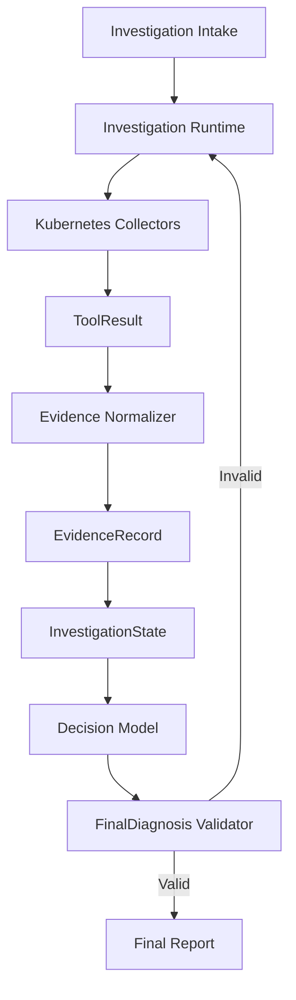

# First Workflow Architecture

The first OpenOps workflow investigates a Kubernetes Deployment whose Pods fail to become Ready because of a broken readiness probe.

The workflow uses only Kubernetes-native, read-only evidence.

---

## Investigation Intake

Purpose: Accepts and validates the investigation request.

Input:

* cluster_context
* namespace
* workload_kind
* workload_name
* symptom
* optional time_window

Output: Validated investigation objective.

Writes:

* `InvestigationState.objective`
* Initial budgets
* Initial phase and status

---

## Investigation Runtime

Purpose: Coordinates the investigation workflow and owns state transitions.

Input:

* Validated investigation objective
* Current `InvestigationState`

Output:

* Tool execution requests
* Updated investigation phase and status
* Completed or failed investigation

Responsibilities:

* Selects the next collector.
* Enforces execution budgets.
* Stores every `ToolResult`.
* Invokes evidence normalization.
* Invokes the decision model.
* Handles diagnosis validation failure.

---

## Kubernetes Collectors

Purpose: Collect raw operational data from the target Kubernetes cluster.

Input:

* Cluster context
* Namespace
* Workload kind
* Workload name
* Collector-specific request

Output: `ToolResult`.

Initial collectors may inspect:

* Deployment state and specification
* Pod state and conditions
* Readiness probe configuration
* Kubernetes events

Rules:

* Collectors are read-only.
* Every execution returns a `ToolResult`.
* Collectors do not create evidence or diagnoses.

---

## ToolResult

Purpose: Represents the deterministic result of one tool execution.

Input: Raw execution outcome.

Output: Structured execution result containing:

* success
* data
* raw_reference
* error_category
* retryable
* duration_ms
* truncated

Storage: Appended to `InvestigationState.tool_results` before evidence normalization.

---

## Evidence Normalizer

Purpose: Converts tool execution results into normalized factual observations.

Input:

* `ToolResult`
* Preserved raw output referenced by the result
* Investigation objective

Output: Zero or more `EvidenceRecord` objects.

Rules:

* Does not diagnose the incident.
* Does not modify existing evidence.
* Multiple evidence records may reference the same raw output.
* Failed or partial tool results may still produce evidence when usable facts exist.

---

## EvidenceRecord

Purpose: Represents one stable and traceable factual observation.

Input: A fact extracted by the evidence normalizer.

Output: Immutable evidence containing:

* id
* source_tool
* timestamp
* target
* observation
* sensitivity
* raw_reference

Storage: Appended to `InvestigationState.evidence`.

---

## InvestigationState

Purpose: Acts as the single structured record of the investigation.

Input:

* Objective
* Tool results
* Evidence records
* Runtime updates
* Final diagnosis

Output: Current investigation context for the runtime and decision model.

Contains:

* objective
* phase
* tool_results
* evidence
* decision
* budgets
* status

Rules:

* Tool results are stored before evidence normalization.
* Evidence is appended after normalization.
* Existing tool results and evidence records are not modified.
* The decision model receives normalized evidence, not raw `ToolResult` objects.

---

## Decision Model

Purpose: Produces a structured diagnosis from collected evidence.

Input:

* Investigation objective
* `InvestigationState.evidence`

Output: Candidate `FinalDiagnosis`.

Rules:

* Must satisfy the `FinalDiagnosis` schema.
* May reference evidence only through evidence IDs.
* Must not reason directly over `ToolResult` objects or preserved raw output.
* Must express uncertainty rather than invent unsupported conclusions.

---

## FinalDiagnosis Validator

Purpose: Determines whether the candidate diagnosis satisfies the diagnosis contract.

Input:

* Candidate `FinalDiagnosis`
* Evidence records stored in `InvestigationState.evidence`

Output:

* Validated `FinalDiagnosis`, or
* Validation errors

Validation includes:

* All required fields are present.
* Confidence uses an allowed value.
* At least one evidence ID is provided.
* Every evidence ID exists in `InvestigationState.evidence`.
* Evidence IDs are unique.
* Unsupported evidence IDs are rejected.

A valid diagnosis is written once to `InvestigationState.decision`.

An invalid diagnosis is not stored or returned as a completed result.

---

## Final Report

Purpose: Presents the validated investigation result to the engineer.

Input: Validated `FinalDiagnosis`.

Output: Structured report containing:

* cause
* confidence
* evidence_ids
* alternatives
* recommendation

The report is produced only after diagnosis validation succeeds.

---

## End-to-End Flow

1. Intake validates the investigation request.
2. The runtime creates `InvestigationState`.
3. The runtime invokes a Kubernetes collector.
4. The collector returns a `ToolResult`.
5. The runtime stores the result in `InvestigationState.tool_results`.
6. The evidence normalizer converts the result into zero or more `EvidenceRecord`s.
7. The records are appended to `InvestigationState.evidence`.
8. The runtime repeats collection until sufficient evidence is available or a budget is exhausted.
9. The decision model produces a candidate `FinalDiagnosis`.
10. The validator checks its schema and evidence references.
11. A valid diagnosis is stored in `InvestigationState.decision`.
12. The final report is returned to the engineer.

---

## Same-Day Boundary

This workflow does not require:

* Web interface
* API service
* Database
* Prometheus or external observability systems
* Persistent memory
* Plugins
* Cloud deployment
* Kubernetes write actions
* Multi-agent coordination
* Automated remediation
